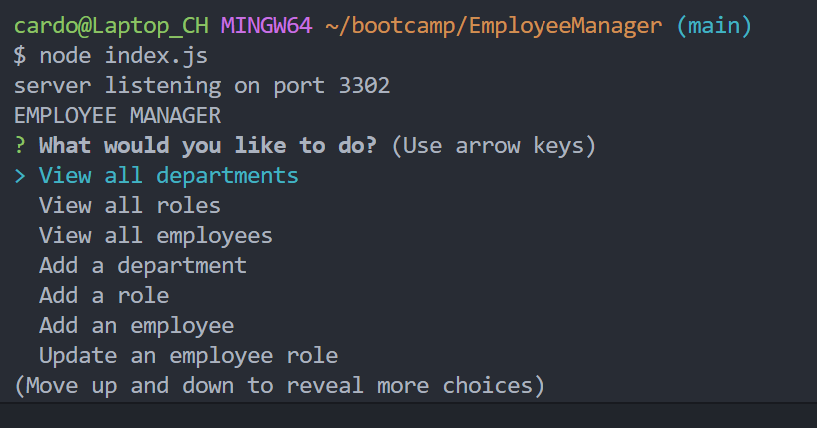

# Employee Manager

## Description

An app to view and manage the departments, roles, and employees in your company

## Table of Contents

- [Installation](#installation)
- [Usage](#usage)
- [License](#license)
- [Contributing](#contributing)
- [Tests](#tests)

## Installation

Download/Git cloning available through my repository

## Usage

Once downloaded/cloned move to the db directory start mysql then run _SOURCE schema.sql_ and if you want to seed it with some example data (optional) run _SOURCE seed.sql_. Then run _node index.js_ in the root directory of the project.

Here is a tutorial/walkthrough:
https://drive.google.com/file/d/178viE5tiVZdHndvJtg9uNQ2VuA_G_SyH/view?usp=sharing

## License

This project is licensed under the [MIT License]([License Details](https://opensource.org/licenses/MIT)).

## Contributing

Cardon Hickman

## Tests

N/A

## Questions

https://github.com/C-Hickman3
cardonhickman@gmail.com
